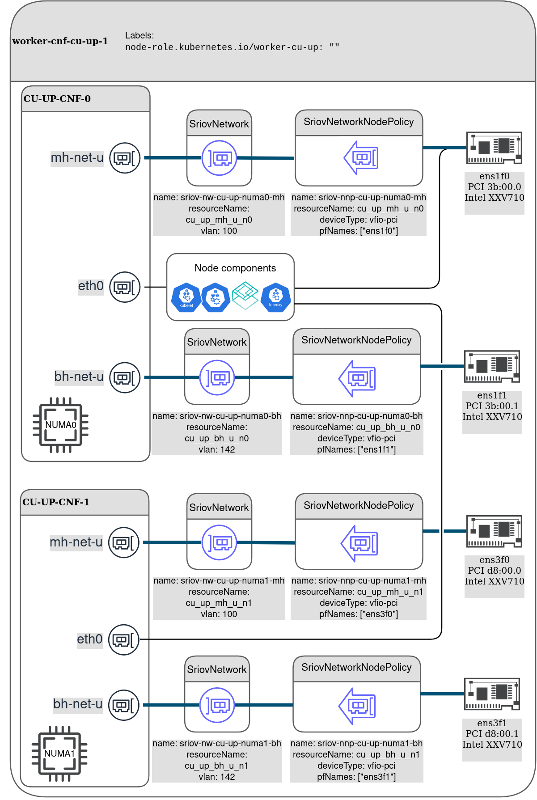

# __Cloud-native RAN profile__

# Introduction
This folder contains an example configurations for 5G radio access network sites.
Radio access network is composed of Centralized units (CU), distributed units (DU) and Radio units (RU). Centralized units are split to control plane and user plane functions (CU-CP and CU-UP respectively).
RAN from the telecommunications standard perspective is shown below:


From the three components composing RAN, only CU and DU can be virtualized and implemented as cloud-native functions.
CU / DU split is driven by real-time computing and networking requirements. A DU can be seen as a real-time part of a telecommunication baseband unit. One distributed unit may aggregate several cells. A CU can be seen as a non-realtime part of a baseband unit, aggregating traffic and controlling one or more distributed units.

A cell in the context of a DU can be seen as a real-time application performing intensive digital signal processing, data transfer and algorithmic tasks. Cells are often using hardware acceleration (FPGA, GPU, eASIC) for DSP processing offload. There are also software-only implementations (FlexRAN), based on AVX-512 instructions. 
Running cell application on COTS hardware requires following features to be enabled:

- Real-time kernel
- CPU isolation
- NUMA awareness
- HUGEPAGES memory management
- Precision timing synchronization using PTP
- AVX-512 instruction set (for Flexran and / or FPGA implementation)
- Additional features depending on the RAN operator requirements

Accessing hardware acceleration devices and high throughput network interface cards by virtualized software applications requires use of SRIOV and Passthrough PCI device virtualization.
In addition to the compute and acceleration requirements, RAN nodes operate on multiple internal and external networks.

# Overview

The [`ran-profile`](ran-profile) directory contains the Kustomize profile for deployment of RAN integration features, namely:
- SCTP MachineConfig patch
- Performance addon operator and CU / DU performance profiles
- PTP operator and slave profile
- SR-IOV operator and associated configurations

# The manifest structure

The profile is built from one cluster specific folder and one or more site-specific folders. This is done to address a deployment that includes remote worker nodes (several sites belonging to the same cluster).
The [`cluster-config`](ran-profile/cluster-config) directory contains performance and PTP customizations based upon operator deployments in [`deploy`](../feature-configs/deploy) folder.
The [`site.1.fqdn`](site.1.fqdn) folder contains site-specific network customizations.


# Prerequisites

## 1. Create machine config pools
There are different configuration requirements for DU, CU-CP and CU-UP nodes.
Create a machine config pool for each of the above node classes, as shown in the examples below.

### CU-UP machine config pool example
The example MCP for the CU-UP is provided in [`cu_up_mcp.yaml`](ran-profile/cluster-config/cu-common/cu_up_mcp.yaml):

```yml
apiVersion: machineconfiguration.openshift.io/v1
kind: MachineConfigPool
metadata:
  name: worker-cu-up
  labels:
    machineconfiguration.openshift.io/role: worker-cu-up
spec:
  machineConfigSelector:
    matchExpressions:
      - {
          key: machineconfiguration.openshift.io/role,
          operator: In,
          values: [worker-cu-up, worker],
        }
  paused: false
  nodeSelector:
    matchLabels:
      node-role.kubernetes.io/worker-cu-up: ""
```
If your deployment contains CU-UP, create the above machine config pool as follows:
```bash
oc apply -f cu_up_mcp.yaml
```
### CU-CP machine config pool example
CU-CP MCP example is provided in [`cu_cp_mcp.yaml`](ran-profile/cluster-config/cu-common/cu_cp_mcp.yaml). Create this MCP as shown above if your cluster contains CU-CP worker nodes.

### DU machine config pool example
DU MCP example is provided in [`du_mcp.yaml`](ran-profile/cluster-config/du-common/du_mcp.yaml). Create this MCP as shown above if your cluster contains DU worker nodes.


## 2. Label the nodes

Include the designated worker nodes in the above machine config pools by labelling them appropriately:

### DU nodes

DU nodes are labeled for both "role" and PTP selectors.
```bash
oc label --overwrite node/{your node name} node-role.kubernetes.io/worker-du=""
oc label --overwrite node/{your node name} ptp/slave=""
```

### CU-CP nodes
```bash
oc label --overwrite node/{your node name} node-role.kubernetes.io/worker-cu-cp=""
```

### CU-UP nodes
```bash
oc label --overwrite node/{your node name} node-role.kubernetes.io/worker-cu-up=""
```

## 3. Update the manifests for your specific hardware 
Performance profiles, SR-IOV network policies and PTP profile must take the specific hardware details into account.

### Performance profile
Update the cpu section of `performance-profile-du.yaml`, `performance-profile-cu-cp.yaml` and `performance-profile-cu-up.yaml` to reflect the amount of CPU cores available on the correspondent nodes, Update the `hugepages` section to reflect your application memory requirements.

### SR-IOV network node policies
Update the SR-IOV network node policies to reflect the manufacturer details and physical NIC port names on your hardware.

#### SR-IOV configuration notes
SriovNetworkNodePolicy object must be configured differently for different NIC models and placements. 

| Manufacturer | deviceType | isRdma |
| --- | --- | --- |
| Intel | __vfio-pci__ or __netdevice__ | __false__ |
| Mellanox | __netdevice__ | __true__ |


In addition, when configuring the `nicSelector`, `pfNames` value must match the intended interface name on the specific host.

If there is a mixed cluster where some of the nodes are deployed with Intel NICs and some with Mellanox, several SR-IOV configurations can be created with the same `resourceName`. The device plugin will discover only the available ones and will put the capacity on the node accordingly.

CU-UP networks are described [here](#cu_up_nw)

CU-CP networks are described [here](#cu_cp_nw)

DU networks are described [here](#du_nw)

#### How to find your NIC information
TODO

### PTP NIC port selector in PTP profile
Update the PTP slave port selector in the [`ptpconfig-slave.yaml`](ran-profile/cluster-config/du-common/ptp/ptpconfig-slave.yaml)
```yml
spec:
  profile:
  - name: "slave"
  # here:
    interface: "eno1"

```


### <a name="cu_up_nw"></a>CU-UP networks


### <a name="cu_cp_nw"></a>CU-CP networks
TODO
### <a name="du_nw"></a>DU networks
TODO

# Deployment

The profile is built in layers with __kustomize__.
To get the profile output, run 
```bash
oc kustomize ran-profile
```
It can be applied manually or with the toolset of your choice (E.g. ArgoCD)

This project contains makefile based tooling, that can be used as follows (from the project root):

  `FEATURES_ENVIRONMENT=cn-ran-overlays FEATURES=ran-profile make feature-deploy`

