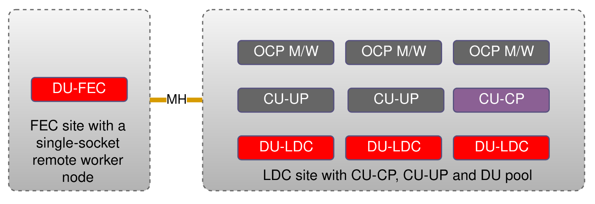

# __Cloud-native RAN profile__

# Introduction
This folder contains an example configurations for 5G radio access network (RAN)sites.
The 5G RAN in the broader context is shown below:

*Source: 3GPP TS 23.501-g60*


RAN external interfaces (N2 and N3) carry control plane and user plane data respectively. They compose RAN backhaul networks. RAN backhaul may also aggregate one or more management networks, while the separation between all the networks is often realized through VLAN tagging.
N1 interface is transparent to RAN (encapsulated in N2).

Radio access network is divided to Centralized units (CU), distributed units (DU) and Radio units (RU). Centralized units are split to control plane and user plane functions (CU-CP and CU-UP respectively).
RAN entities and internal interfaces from the telecommunications standard perspective are shown below:


From the three components composing RAN, only CU and DU can be virtualized and implemented as cloud-native functions.
CU / DU split is driven by real-time computing and networking requirements. A DU can be seen as a real-time part of a telecommunication baseband unit. One distributed unit may aggregate several cells. A CU can be seen as a non-realtime part of a baseband unit, aggregating traffic and controlling one or more distributed units.

A cell in the context of a DU can be seen as a real-time application performing intensive digital signal processing, data transfer and algorithmic tasks. Cells are often using hardware acceleration (FPGA, GPU, eASIC) for DSP processing offload. There are also software-only implementations (FlexRAN), based on AVX-512 instructions. 
Running cell application on COTS hardware requires following features to be enabled:

- Real-time kernel
- CPU isolation
- NUMA awareness
- HUGEPAGES memory management
- Precision timing synchronization using PTP
- AVX-512 instruction set (for Flexran and / or FPGA implementation)
- Additional features depending on the RAN operator requirements

Accessing hardware acceleration devices and high throughput network interface cards by virtualized software applications requires use of SRIOV and Passthrough PCI device virtualization.
In addition to the compute and acceleration requirements, RAN nodes operate on multiple internal and external networks.

# Overview

The [`ran-profile`](ran-profile) directory contains the Kustomize profile for deployment of RAN integration features, namely:
- SCTP MachineConfig patch
- Performance addon operator and CU / DU performance profiles
- PTP operator and slave profile
- SR-IOV operator and associated configurations

## The deployment model

The RAN deployment modeled here is shown below:


The OCP cluster aggregates two sites. There is a local data center (Site 2), that hosts the OCP control plane, a pool of CU-UP nodes, one CU-CP node and a pool of DU nodes deployed on a dual-socket servers.

In addition, there is a FEC site (Site 1) containing one DU remote worker node implemented on a single-socket server.

## The manifest structure

The manifest structure follows the deployment model described above.
The profile is built from one cluster specific folder and one or more site-specific folders. 
The [`cluster-config`](ran-profile/cluster-config) directory contains performance and PTP customizations based upon operator deployments in [`deploy`](../feature-configs/deploy) folder.
The [`site.1.fqdn`](site.1.fqdn) and [`site.2.fqdn`](site.2.fqdn) folders contain site-specific customizations. The number of site-specific folders can be increased to fit the particular deployment.


# Prerequisites

## 1. Label the nodes
The profile installs four machine config pools: cu-up, cu-cp, du-fec and du-ldc.
Include the designated worker nodes in the above machine config pools by labelling them as described below. PTP profile will be istalled to worker nodes labelled as `worker-du-fec` or `worker-du-ldc`. 

### DU FEC nodes

```bash
oc label --overwrite node/{your node name} node-role.kubernetes.io/worker-du-fec=""
```

### DU LDC nodes

```bash
oc label --overwrite node/{your node name} node-role.kubernetes.io/worker-du-ldc=""
```

### CU-CP nodes
```bash
oc label --overwrite node/{your node name} node-role.kubernetes.io/worker-cu-cp=""
```


### CU-UP nodes
```bash
oc label --overwrite node/{your node name} node-role.kubernetes.io/worker-cu-up=""
```


## 2. Update the manifests for your specific hardware 
Performance profiles, SR-IOV network policies and PTP profile must take the specific hardware details into account.


### Performance profile
In the site folders, update the cpu section of `performance-profile-du-fec.yaml`, `performance-profile-du-ldc.yaml`, `performance-profile-cu-cp.yaml` and `performance-profile-cu-up.yaml` to reflect the amount of CPU cores available on the correspondent nodes, Update the `hugepages` section to reflect your application memory requirements. Update `additionalKernelArgs` to enable or disable the hyperthreading.

### SR-IOV network node policies
In the site folders, update the SR-IOV network node policies to reflect the manufacturer details and physical NIC port names on your hardware.


#### SR-IOV configuration notes
SriovNetworkNodePolicy object must be configured differently for different NIC models and placements. 

| Manufacturer | deviceType | isRdma |
| --- | --- | --- |
| Intel | __vfio-pci__ or __netdevice__ | __false__ |
| Mellanox | __netdevice__ | __true__ |


In addition, when configuring the `nicSelector`, `pfNames` value must match the intended interface name on the specific host.

If there is a mixed cluster where some of the nodes are deployed with Intel NICs and some with Mellanox, several SR-IOV configurations can be created with the same `resourceName`. The device plugin will discover only the available ones and will put the capacity on the node accordingly.

CU-UP networks are described [here](#cu_up_nw)

CU-CP networks are described [here](#cu_cp_nw)

DU networks are described [here](#du_nw)


#### __How to find your NIC information__
SSH to your worker node:
```bash
ssh core@<your worker node>
```


##### __Find relation between interface names and PCI addresses__
```bash
[core@node ~]$ grep PCI_SLOT_NAME /sys/class/net/*/device/uevent
/sys/class/net/eno1/device/uevent:PCI_SLOT_NAME=0000:19:00.0
/sys/class/net/eno2/device/uevent:PCI_SLOT_NAME=0000:19:00.1
/sys/class/net/ens1f0/device/uevent:PCI_SLOT_NAME=0000:3b:00.0
/sys/class/net/ens1f1/device/uevent:PCI_SLOT_NAME=0000:3b:00.1
/sys/class/net/ens3f0/device/uevent:PCI_SLOT_NAME=0000:d8:00.0
/sys/class/net/ens3f1/device/uevent:PCI_SLOT_NAME=0000:d8:00.1

```


##### __Find NIC NUMA nodes__

```bash
[core@node ~]$ cat /sys/class/net/*/device/numa_node
0
0
0
0
1
1

```


##### __Find relation between PCI addresses and NIC manufacturers__
```bash
[core@node ~]$ lspci |grep Ether
19:00.0 Ethernet controller: Mellanox Technologies MT27710 Family [ConnectX-4 Lx]
19:00.1 Ethernet controller: Mellanox Technologies MT27710 Family [ConnectX-4 Lx]
3b:00.0 Ethernet controller: Intel Corporation Ethernet Controller XXV710 for 25GbE SFP28 (rev 02)
3b:00.1 Ethernet controller: Intel Corporation Ethernet Controller XXV710 for 25GbE SFP28 (rev 02)
d8:00.0 Ethernet controller: Intel Corporation Ethernet Controller XXV710 for 25GbE SFP28 (rev 02)
d8:00.1 Ethernet controller: Intel Corporation Ethernet Controller XXV710 for 25GbE SFP28 (rev 02)

```


### PTP NIC port selector in PTP profile
Update the PTP slave port selector in the site folders to match your designated PTP port name:

```yml
spec:
  profile:
  - name: "slave"
  # here:
    interface: "eno1"

```


### <a name="cu_up_nw"></a>CU-UP networks

In addition to default cluster network, CU-UP operates on the following networks in this example:
- __mh-net-u__ - Midhaul user plane network. The standard name of this network is F1-U, but in practical implementation it can be aggregated with management network(s)
- __bh-net-u__ - Backhaul user plane network


### <a name="cu_cp_nw"></a>CU-CP networks
TODO
### <a name="du_nw"></a>DU networks
TODO

# Deployment

> :warning: __Please label the nodes before the deployment.__

The profile is built in layers with __kustomize__.
To get the profile output, run 
```bash
oc kustomize ran-profile
```
It can be applied manually or with the toolset of your choice (E.g. ArgoCD)

This project contains makefile based tooling, that can be used as follows (from the project root):

  `FEATURES_ENVIRONMENT=cn-ran-overlays FEATURES=ran-profile make feature-deploy`

