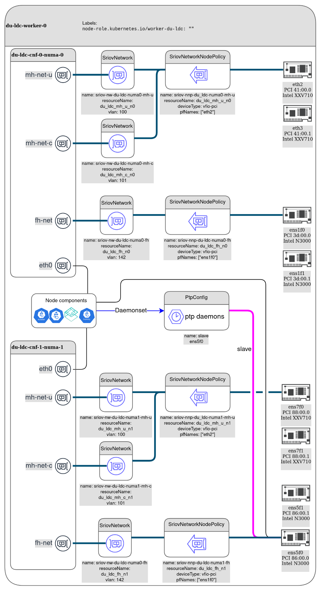

# __Cloud-native RAN profile__

# Introduction
This folder contains an example configurations for 5G radio access network (RAN).
The 5G RAN in the broader context is shown below:

*Source: 3GPP TS 23.501-g60*


RAN external interfaces (N2 and N3) carry control plane and user plane data respectively. They compose RAN backhaul networks. RAN backhaul may also aggregate one or more management networks, while the separation between all the networks is often realized through VLAN tagging.
N1 interface is transparent to RAN (encapsulated in N2).

Radio access network is divided to Centralized units (CU), distributed units (DU) and Radio units (RU). Centralized units are split to control plane and user plane functions (CU-CP and CU-UP respectively).
RAN entities and internal interfaces from the telecommunications standard perspective are shown below:


From the high level blocks composing RAN (CU, DU, RU), only CU and DU can be virtualized and implemented as cloud-native functions.
CU / DU split is driven by real-time computing and networking requirements. A DU can be seen as a real-time part of a telecommunication baseband unit. One distributed unit may aggregate several cells. A CU can be seen as a non-realtime part of a baseband unit, aggregating traffic and controlling one or more distributed units.

A cell in the context of a DU can be seen as a real-time application performing intensive digital signal processing, data transfer and algorithmic tasks. Cells are often using hardware acceleration (FPGA, GPU, eASIC) for DSP processing offload. There are also software-only implementations (FlexRAN), based on AVX-512 instructions. 
Running cell application on COTS hardware requires following features to be enabled:

- Real-time kernel
- CPU isolation
- NUMA awareness
- HUGEPAGES memory management
- Precision timing synchronization using PTP
- AVX-512 instruction set (for Flexran and / or FPGA implementation)
- Additional features depending on the RAN operator requirements

Accessing hardware acceleration devices and high throughput network interface cards by virtualized software applications requires use of SR-IOV and/or Passthrough PCI device virtualization.
In addition to the compute and acceleration requirements, RAN nodes operate on multiple internal and external networks.

# Overview

The current directory contains declarative manifests for RAN integration features deployment, namely:
- SCTP MachineConfig patch
- Performance addon operator and CU / DU performance profiles
- PTP operator and slave profile
- SR-IOV operator and associated configurations

## The deployment model

The RAN deployment modeled here is shown below:


The OCP cluster aggregates two sites. There is a local data center (`site-ldc`), that hosts a pool of CU-UP nodes, one CU-CP node and a pool of DU nodes deployed on a dual-socket servers.
In addition, there is a FEC site (`site-fec`) containing one DU remote worker node implemented on a single-socket server.
This means that the cluster we are deploying will have at least the following worker node types:

- __worker-du-fec__ - A DU worker node implemented on a single-socket server, with performance tuning, ptp synchronization, SCTP patch and at least three SR-IOV networks (in addition to the Openshift cluster network, BMC and other management networks, that are out of this model' scope):
    - The fronthaul network, connecting the DU to the RU(s)
    - The midhaul user plane network, connecting the DU to CU-UP and carrying the user traffic
    - The midhaul control plane network, connecting the DU to CU-CP and carrying the F1AP protocol [3GPP TS 38.473](https://www.3gpp.org/ftp//Specs/archive/38_series/38.473/)
  DU networks are described [here](#du_nw)
- __worker-du-ldc__ - A DU worker node implemented on a dual-socket server. Contains the same modifications as worker-du-fec, with the nunber of SR-IOV networks raising to 6 (three per NUMA node). 
- __worker-cu-up__ - A CU-UP node implemented on a dual-socket server. CU-UP will have different pereformance optimizations than a DU, and will use NTP for time synchronization. CU-UP will require two SR-IOV networks per NUMA node, one for the midhaul connection to distributed units, and another - for the backhaul connection to the 5G core. Total four SR-IOV networks  per node. CU-UP networks are described [here](#cu_up_nw)
- __worker-cu-cp__ - A CU-CP node implemented on a dual-socket server. Has similar requirements to CU-UP (not implemented in the current version of the RAN profile.)


### <a name="cu_up_nw"></a>CU-UP networks


### <a name="du_nw"></a>DU networks



## The manifest structure

The manifest structure follows the deployment model, and allows deployment and configuration of the machine types described above.
### Folder tree

── common
│   ├── basic-profile
│   └── patches
├── cu-up
│   ├── customizations
│   └── networks
├── du-fec
│   ├── customizations
│   └── networks
├── du-ldc
│   ├── customizations
│   └── networks
├── images
└── utils
    └── mcp


### common
The [common](./common) folder contains [basic-profile](./common/basic-profile) and [patches](./common/patches) folders.
The [basic-profile](./common/basic-profile) folder contalins the performance and PTP profiles and references the operator deployments in the project' [`deploy`](../feature-configs/deploy) folder. The [basic-profile](./common/basic-profile) `kustomization.yaml` file links to the superset of the operator deployments without taking into account the unit types to be deployed on the cluster. The downside of this arrangement is that PTP operator will be installed on the clusters that do not contain distributed units. However, since PTP configuration is deployed using node selectors, no harm is done. from another side this allows to configure the operator deployment in a single file([kustomization.yaml](./common/basic-profile/kustomization.yaml))
The [patches](./common/patches) folder contains temporary patches that must be applied for the configuration to function properly. The patches are linked only by the specific unit types and allow temporary workarounds to problems being discovered in the formal versions.


### Unit type examples
The [`cu-up`](./cu-up),  [`du-fec`](du-fec) and [`du-ldc`](du-ldc) folders contain node type specific customizations. The number of node type specific folders can be increased to fit the particular deployment (see [Scaling](#scaling))
Each unit type folder contains two folders: `customizations` and `networks`.
The `customizations` folder contalns patches applied on top of the basic profile for the specific hardware used, as well as links to the patches relevant for the specific unit type. For example, here is the patches applied on the basic performance profile to suit du-fec:

```yml
- op: replace
  path: /metadata
  value:
    name: perf-du-fec

# Handled by kernel-patch customization
# - op: replace
#   path: /spec/realTimeKernel/enabled
#   value: true

- op: add
  path: /spec/additionalKernelArgs
  value: [ nosmt ]
  
# Accommodate one NUMA node
- op: replace
  path: /spec/cpu/isolated
  value: "2-25"

- op: replace
  path: /spec/nodeSelector
  value:
    node-role.kubernetes.io/worker-du-fec: ""
```

### images
Contains bitmaps used in this `README.md`

### utils
Contains `clone.sh` file (see [Scaling](#scaling)) and `mcp` folder with sample machine config pool definitions (see [Prerequisites](#mcp))

## <a name="scaling"></a>Scaling
This structure can be easily scaled to accommodate more worker node types, however the assumption is that all the nodes performing the same function in a particular cluster will be identical in terms of the hardware used and the VLAN tags. If there is a need to create a new node type (due to a different hardware or a different network configuration), [clone.sh](./utils/clone.sh) comes to the rescue.
Let's create a CU-CP machine type for our cluster. 
From the `utils` directory run: 
```bash
[user@host utils]$ ./clone.sh .. cu-up cu-cp
Done
```
The `cu-cp` folder will be created amd patched to contain names and node selectors templated from the `cu-cp` name.
The resulting profile can be seen as follows:
```bash
[user@host utils]$ /tmp/kustomize build ../cu-up
```

```{css, echo=FALSE}
pre {
  max-height: 300px;
  overflow-y: auto;
}

pre[class] {
  max-height: 100px;
}
```

``{css, echo=FALSE}
.scroll-100 {
  max-height: 100px;
  overflow-y: auto;
  background-color: inherit;
}
```

```{yml, class.output="scroll-100"}

apiVersion: v1
kind: Namespace
metadata:
  labels:
    openshift.io/cluster-monitoring: "true"
  name: openshift-performance-addon-operator
spec: {}
---
apiVersion: v1
kind: Namespace
metadata:
  labels:
    openshift.io/cluster-monitoring: "true"
    openshift.io/run-level: "1"
  name: openshift-ptp
---
apiVersion: v1
kind: Namespace
metadata:
  labels:
    openshift.io/run-level: "1"
  name: openshift-sriov-network-operator
---
apiVersion: v1
kind: Namespace
metadata:
  name: site-cu-up-network-namespace
---
apiVersion: machineconfiguration.openshift.io/v1
kind: MachineConfig
metadata:
  labels:
    machineconfiguration.openshift.io/role: worker-cu-up
  name: load-sctp-module-cu-up
spec:
  config:
    ignition:
      version: 2.2.0
    storage:
      files:
      - contents:
          source: data:,
          verification: {}
        filesystem: root
        mode: 420
        path: /etc/modprobe.d/sctp-blacklist.conf
      - contents:
          source: data:text/plain;charset=utf-8,sctp
        filesystem: root
        mode: 420
        path: /etc/modules-load.d/sctp-load.conf
---
apiVersion: operators.coreos.com/v1
kind: OperatorGroup
metadata:
  name: performance-addon-operator
  namespace: openshift-performance-addon-operator
---
apiVersion: operators.coreos.com/v1
kind: OperatorGroup
metadata:
  name: ptp-operators
  namespace: openshift-ptp
spec:
  targetNamespaces:
  - openshift-ptp
---
apiVersion: operators.coreos.com/v1
kind: OperatorGroup
metadata:
  name: sriov-network-operators
  namespace: openshift-sriov-network-operator
spec:
  targetNamespaces:
  - openshift-sriov-network-operator
---
apiVersion: operators.coreos.com/v1alpha1
kind: CatalogSource
metadata:
  name: performance-addon-operator
  namespace: openshift-marketplace
spec:
  displayName: Openshift Performance Addon Operator
  icon:
    base64data: ""
    mediatype: ""
  image: quay.io/openshift-kni/performance-addon-operator-index:4.7-snapshot
  publisher: Red Hat
  sourceType: grpc
---
apiVersion: operators.coreos.com/v1alpha1
kind: Subscription
metadata:
  name: performance-addon-operator
  namespace: openshift-performance-addon-operator
spec:
  channel: "4.7"
  name: performance-addon-operator
  source: performance-addon-operator
  sourceNamespace: openshift-marketplace
---
apiVersion: operators.coreos.com/v1alpha1
kind: Subscription
metadata:
  name: ptp-operator-subscription
  namespace: openshift-ptp
spec:
  channel: "4.6"
  name: ptp-operator
  source: redhat-operators
  sourceNamespace: openshift-marketplace
---
apiVersion: operators.coreos.com/v1alpha1
kind: Subscription
metadata:
  name: sriov-network-operator-subscription
  namespace: openshift-sriov-network-operator
spec:
  channel: "4.6"
  name: sriov-network-operator
  source: redhat-operators
  sourceNamespace: openshift-marketplace
---
apiVersion: performance.openshift.io/v1
kind: PerformanceProfile
metadata:
  name: perf-cu-up
spec:
  cpu:
    isolated: 2-51
    reserved: 0-1
  hugepages:
    defaultHugepagesSize: 1G
    pages:
    - count: 16
      node: 0
      size: 1G
  nodeSelector:
    node-role.kubernetes.io/worker-cu-up: ""
  numa:
    topologyPolicy: restricted
  realTimeKernel:
    enabled: false
---
apiVersion: ptp.openshift.io/v1
kind: PtpConfig
metadata:
  name: slave
  namespace: openshift-ptp
spec:
  profile:
  - interface: ens1f0
    name: slave
    phc2sysOpts: -a -r -n 24
    ptp4lConf: |
      [global]
      #
      # Default Data Set
      #
      twoStepFlag 1
      slaveOnly 0
      priority1 128
      priority2 128
      domainNumber 24
      #utc_offset 37
      clockClass 248
      clockAccuracy 0xFE
      offsetScaledLogVariance 0xFFFF
      free_running 0
      freq_est_interval 1
      dscp_event 0
      dscp_general 0
      dataset_comparison ieee1588
      G.8275.defaultDS.localPriority 128
      #
      # Port Data Set
      #
      logAnnounceInterval -3
      logSyncInterval -4
      logMinDelayReqInterval -4
      logMinPdelayReqInterval -4
      announceReceiptTimeout 3
      syncReceiptTimeout 0
      delayAsymmetry 0
      fault_reset_interval 4
      neighborPropDelayThresh 20000000
      masterOnly 0
      G.8275.portDS.localPriority 128
      #
      # Run time options
      #
      assume_two_step 0
      logging_level 6
      path_trace_enabled 0
      follow_up_info 0
      hybrid_e2e 0
      inhibit_multicast_service 0
      net_sync_monitor 0
      tc_spanning_tree 0
      tx_timestamp_timeout 1
      unicast_listen 0
      unicast_master_table 0
      unicast_req_duration 3600
      use_syslog 1
      verbose 0
      summary_interval 0
      kernel_leap 1
      check_fup_sync 0
      #
      # Servo Options
      #
      pi_proportional_const 0.0
      pi_integral_const 0.0
      pi_proportional_scale 0.0
      pi_proportional_exponent -0.3
      pi_proportional_norm_max 0.7
      pi_integral_scale 0.0
      pi_integral_exponent 0.4
      pi_integral_norm_max 0.3
      step_threshold 0.0
      first_step_threshold 0.00002
      max_frequency 900000000
      clock_servo pi
      sanity_freq_limit 200000000
      ntpshm_segment 0
      #
      # Transport options
      #
      transportSpecific 0x0
      ptp_dst_mac 01:1B:19:00:00:00
      p2p_dst_mac 01:80:C2:00:00:0E
      udp_ttl 1
      udp6_scope 0x0E
      uds_address /var/run/ptp4l
      #
      # Default interface options
      #
      clock_type OC
      network_transport UDPv4
      delay_mechanism E2E
      time_stamping hardware
      tsproc_mode filter
      delay_filter moving_median
      delay_filter_length 10
      egressLatency 0
      ingressLatency 0
      boundary_clock_jbod 0
      #
      # Clock description
      #
      productDescription ;;
      revisionData ;;
      manufacturerIdentity 00:00:00
      userDescription ;
      timeSource 0xA0
    ptp4lOpts: -2 -s --summary_interval -4
  recommend:
  - match:
    - nodeLabel: ptp/slave
    priority: 4
    profile: slave
---
apiVersion: sriovnetwork.openshift.io/v1
kind: SriovNetwork
metadata:
  name: sriov-nw-cu-up-numa0-bh
  namespace: openshift-sriov-network-operator
spec:
  ipam: |
    {
    }
  networkNamespace: site-cu-up-network-namespace
  resourceName: cu_up_bh_n0
  vlan: 142
---
apiVersion: sriovnetwork.openshift.io/v1
kind: SriovNetwork
metadata:
  name: sriov-nw-cu-up-numa0-mh
  namespace: openshift-sriov-network-operator
spec:
  ipam: |
    {
    }
  networkNamespace: site-cu-up-network-namespace
  resourceName: cu_up_mh_n0
  vlan: 101
---
apiVersion: sriovnetwork.openshift.io/v1
kind: SriovNetwork
metadata:
  name: sriov-nw-cu-up-numa1-bh
  namespace: openshift-sriov-network-operator
spec:
  ipam: |
    {
    }
  networkNamespace: site-cu-up-network-namespace
  resourceName: cu_up_bh_n1
  vlan: 142
---
apiVersion: sriovnetwork.openshift.io/v1
kind: SriovNetwork
metadata:
  name: sriov-nw-cu-up-numa1-mh
  namespace: openshift-sriov-network-operator
spec:
  ipam: |
    {
    }
  networkNamespace: site-cu-up-network-namespace
  resourceName: cu_up_mh_n1
  vlan: 101
---
apiVersion: sriovnetwork.openshift.io/v1
kind: SriovNetworkNodePolicy
metadata:
  name: sriov-nnp-cu-up-numa0-bh
  namespace: openshift-sriov-network-operator
spec:
  deviceType: vfio-pci
  isRdma: false
  nicSelector:
    pfNames:
    - ens1f0
  nodeSelector:
    node-role.kubernetes.io/worker-cu-up: ""
  numVfs: 5
  priority: 10
  resourceName: cu_up_bh_n0
---
apiVersion: sriovnetwork.openshift.io/v1
kind: SriovNetworkNodePolicy
metadata:
  name: sriov-nnp-cu-up-numa0-mh
  namespace: openshift-sriov-network-operator
spec:
  deviceType: vfio-pci
  isRdma: false
  nicSelector:
    pfNames:
    - ens1f1
  nodeSelector:
    node-role.kubernetes.io/worker-cu-up: ""
  numVfs: 5
  priority: 10
  resourceName: cu_up_mh_n0
---
apiVersion: sriovnetwork.openshift.io/v1
kind: SriovNetworkNodePolicy
metadata:
  name: sriov-nnp-cu-up-numa1-bh
  namespace: openshift-sriov-network-operator
spec:
  deviceType: vfio-pci
  isRdma: false
  nicSelector:
    pfNames:
    - ens3f0
  nodeSelector:
    node-role.kubernetes.io/worker-cu-up: ""
  numVfs: 5
  priority: 10
  resourceName: cu_up_bh_n1
---
apiVersion: sriovnetwork.openshift.io/v1
kind: SriovNetworkNodePolicy
metadata:
  name: sriov-nnp-cu-up-numa1-mh
  namespace: openshift-sriov-network-operator
spec:
  deviceType: vfio-pci
  isRdma: false
  nicSelector:
    pfNames:
    - ens3f1
  nodeSelector:
    node-role.kubernetes.io/worker-cu-up: ""
  numVfs: 5
  priority: 10
  resourceName: cu_up_mh_n1
[vgrinber@vgrinber utils]$ /tmp/kustomize build ../cu-cp
apiVersion: v1
kind: Namespace
metadata:
  labels:
    openshift.io/cluster-monitoring: "true"
  name: openshift-performance-addon-operator
spec: {}
---
apiVersion: v1
kind: Namespace
metadata:
  labels:
    openshift.io/cluster-monitoring: "true"
    openshift.io/run-level: "1"
  name: openshift-ptp
---
apiVersion: v1
kind: Namespace
metadata:
  labels:
    openshift.io/run-level: "1"
  name: openshift-sriov-network-operator
---
apiVersion: v1
kind: Namespace
metadata:
  name: site-cu-cp-network-namespace
---
apiVersion: machineconfiguration.openshift.io/v1
kind: MachineConfig
metadata:
  labels:
    machineconfiguration.openshift.io/role: worker-cu-cp
  name: load-sctp-module-cu-cp
spec:
  config:
    ignition:
      version: 2.2.0
    storage:
      files:
      - contents:
          source: data:,
          verification: {}
        filesystem: root
        mode: 420
        path: /etc/modprobe.d/sctp-blacklist.conf
      - contents:
          source: data:text/plain;charset=utf-8,sctp
        filesystem: root
        mode: 420
        path: /etc/modules-load.d/sctp-load.conf
---
apiVersion: operators.coreos.com/v1
kind: OperatorGroup
metadata:
  name: performance-addon-operator
  namespace: openshift-performance-addon-operator
---
apiVersion: operators.coreos.com/v1
kind: OperatorGroup
metadata:
  name: ptp-operators
  namespace: openshift-ptp
spec:
  targetNamespaces:
  - openshift-ptp
---
apiVersion: operators.coreos.com/v1
kind: OperatorGroup
metadata:
  name: sriov-network-operators
  namespace: openshift-sriov-network-operator
spec:
  targetNamespaces:
  - openshift-sriov-network-operator
---
apiVersion: operators.coreos.com/v1alpha1
kind: CatalogSource
metadata:
  name: performance-addon-operator
  namespace: openshift-marketplace
spec:
  displayName: Openshift Performance Addon Operator
  icon:
    base64data: ""
    mediatype: ""
  image: quay.io/openshift-kni/performance-addon-operator-index:4.7-snapshot
  publisher: Red Hat
  sourceType: grpc
---
apiVersion: operators.coreos.com/v1alpha1
kind: Subscription
metadata:
  name: performance-addon-operator
  namespace: openshift-performance-addon-operator
spec:
  channel: "4.7"
  name: performance-addon-operator
  source: performance-addon-operator
  sourceNamespace: openshift-marketplace
---
apiVersion: operators.coreos.com/v1alpha1
kind: Subscription
metadata:
  name: ptp-operator-subscription
  namespace: openshift-ptp
spec:
  channel: "4.6"
  name: ptp-operator
  source: redhat-operators
  sourceNamespace: openshift-marketplace
---
apiVersion: operators.coreos.com/v1alpha1
kind: Subscription
metadata:
  name: sriov-network-operator-subscription
  namespace: openshift-sriov-network-operator
spec:
  channel: "4.6"
  name: sriov-network-operator
  source: redhat-operators
  sourceNamespace: openshift-marketplace
---
apiVersion: performance.openshift.io/v1
kind: PerformanceProfile
metadata:
  name: perf-cu-cp
spec:
  cpu:
    isolated: 2-51
    reserved: 0-1
  hugepages:
    defaultHugepagesSize: 1G
    pages:
    - count: 16
      node: 0
      size: 1G
  nodeSelector:
    node-role.kubernetes.io/worker-cu-cp: ""
  numa:
    topologyPolicy: restricted
  realTimeKernel:
    enabled: false
---
apiVersion: ptp.openshift.io/v1
kind: PtpConfig
metadata:
  name: slave
  namespace: openshift-ptp
spec:
  profile:
  - interface: ens1f0
    name: slave
    phc2sysOpts: -a -r -n 24
    ptp4lConf: |
      [global]
      #
      # Default Data Set
      #
      twoStepFlag 1
      slaveOnly 0
      priority1 128
      priority2 128
      domainNumber 24
      #utc_offset 37
      clockClass 248
      clockAccuracy 0xFE
      offsetScaledLogVariance 0xFFFF
      free_running 0
      freq_est_interval 1
      dscp_event 0
      dscp_general 0
      dataset_comparison ieee1588
      G.8275.defaultDS.localPriority 128
      #
      # Port Data Set
      #
      logAnnounceInterval -3
      logSyncInterval -4
      logMinDelayReqInterval -4
      logMinPdelayReqInterval -4
      announceReceiptTimeout 3
      syncReceiptTimeout 0
      delayAsymmetry 0
      fault_reset_interval 4
      neighborPropDelayThresh 20000000
      masterOnly 0
      G.8275.portDS.localPriority 128
      #
      # Run time options
      #
      assume_two_step 0
      logging_level 6
      path_trace_enabled 0
      follow_up_info 0
      hybrid_e2e 0
      inhibit_multicast_service 0
      net_sync_monitor 0
      tc_spanning_tree 0
      tx_timestamp_timeout 1
      unicast_listen 0
      unicast_master_table 0
      unicast_req_duration 3600
      use_syslog 1
      verbose 0
      summary_interval 0
      kernel_leap 1
      check_fup_sync 0
      #
      # Servo Options
      #
      pi_proportional_const 0.0
      pi_integral_const 0.0
      pi_proportional_scale 0.0
      pi_proportional_exponent -0.3
      pi_proportional_norm_max 0.7
      pi_integral_scale 0.0
      pi_integral_exponent 0.4
      pi_integral_norm_max 0.3
      step_threshold 0.0
      first_step_threshold 0.00002
      max_frequency 900000000
      clock_servo pi
      sanity_freq_limit 200000000
      ntpshm_segment 0
      #
      # Transport options
      #
      transportSpecific 0x0
      ptp_dst_mac 01:1B:19:00:00:00
      p2p_dst_mac 01:80:C2:00:00:0E
      udp_ttl 1
      udp6_scope 0x0E
      uds_address /var/run/ptp4l
      #
      # Default interface options
      #
      clock_type OC
      network_transport UDPv4
      delay_mechanism E2E
      time_stamping hardware
      tsproc_mode filter
      delay_filter moving_median
      delay_filter_length 10
      egressLatency 0
      ingressLatency 0
      boundary_clock_jbod 0
      #
      # Clock description
      #
      productDescription ;;
      revisionData ;;
      manufacturerIdentity 00:00:00
      userDescription ;
      timeSource 0xA0
    ptp4lOpts: -2 -s --summary_interval -4
  recommend:
  - match:
    - nodeLabel: ptp/slave
    priority: 4
    profile: slave
---
apiVersion: sriovnetwork.openshift.io/v1
kind: SriovNetwork
metadata:
  name: sriov-nw-cu-cp-numa0-bh
  namespace: openshift-sriov-network-operator
spec:
  ipam: |
    {
    }
  networkNamespace: site-cu-cp-network-namespace
  resourceName: cu_cp_bh_n0
  vlan: 142
---
apiVersion: sriovnetwork.openshift.io/v1
kind: SriovNetwork
metadata:
  name: sriov-nw-cu-cp-numa0-mh
  namespace: openshift-sriov-network-operator
spec:
  ipam: |
    {
    }
  networkNamespace: site-cu-cp-network-namespace
  resourceName: cu_cp_mh_n0
  vlan: 101
---
apiVersion: sriovnetwork.openshift.io/v1
kind: SriovNetwork
metadata:
  name: sriov-nw-cu-cp-numa1-bh
  namespace: openshift-sriov-network-operator
spec:
  ipam: |
    {
    }
  networkNamespace: site-cu-cp-network-namespace
  resourceName: cu_cp_bh_n1
  vlan: 142
---
apiVersion: sriovnetwork.openshift.io/v1
kind: SriovNetwork
metadata:
  name: sriov-nw-cu-cp-numa1-mh
  namespace: openshift-sriov-network-operator
spec:
  ipam: |
    {
    }
  networkNamespace: site-cu-cp-network-namespace
  resourceName: cu_cp_mh_n1
  vlan: 101
---
apiVersion: sriovnetwork.openshift.io/v1
kind: SriovNetworkNodePolicy
metadata:
  name: sriov-nnp-cu-cp-numa0-bh
  namespace: openshift-sriov-network-operator
spec:
  deviceType: vfio-pci
  isRdma: false
  nicSelector:
    pfNames:
    - ens1f0
  nodeSelector:
    node-role.kubernetes.io/worker-cu-cp: ""
  numVfs: 5
  priority: 10
  resourceName: cu_cp_bh_n0
---
apiVersion: sriovnetwork.openshift.io/v1
kind: SriovNetworkNodePolicy
metadata:
  name: sriov-nnp-cu-cp-numa0-mh
  namespace: openshift-sriov-network-operator
spec:
  deviceType: vfio-pci
  isRdma: false
  nicSelector:
    pfNames:
    - ens1f1
  nodeSelector:
    node-role.kubernetes.io/worker-cu-cp: ""
  numVfs: 5
  priority: 10
  resourceName: cu_cp_mh_n0
---
apiVersion: sriovnetwork.openshift.io/v1
kind: SriovNetworkNodePolicy
metadata:
  name: sriov-nnp-cu-cp-numa1-bh
  namespace: openshift-sriov-network-operator
spec:
  deviceType: vfio-pci
  isRdma: false
  nicSelector:
    pfNames:
    - ens3f0
  nodeSelector:
    node-role.kubernetes.io/worker-cu-cp: ""
  numVfs: 5
  priority: 10
  resourceName: cu_cp_bh_n1
---
apiVersion: sriovnetwork.openshift.io/v1
kind: SriovNetworkNodePolicy
metadata:
  name: sriov-nnp-cu-cp-numa1-mh
  namespace: openshift-sriov-network-operator
spec:
  deviceType: vfio-pci
  isRdma: false
  nicSelector:
    pfNames:
    - ens3f1
  nodeSelector:
    node-role.kubernetes.io/worker-cu-cp: ""
  numVfs: 5
  priority: 10
  resourceName: cu_cp_mh_n1
```


# Prerequisites


## 1. <a name="mcp"></a>Create machine config pools for the RAN worker nodes. 

### DU-FEC worker example:

```bash

cat <<EOF | oc apply -f -
apiVersion: machineconfiguration.openshift.io/v1
kind: MachineConfigPool
metadata:
  name: worker-du-fec
  labels:
    machineconfiguration.openshift.io/role: worker-du-fec
spec:
  machineConfigSelector:
    matchExpressions:
      - {
          key: machineconfiguration.openshift.io/role,
          operator: In,
          values: [worker-du-fec, worker],
        }
  paused: false
  nodeSelector:
    matchLabels:
      node-role.kubernetes.io/worker-du-fec: ""
---
EOF
```

### Other node types
For DU-LDC, CU-UP and other types you might need, create as many additional machine config pools as needed for your deployment

## 2. Label the nodes
Include the designated worker nodes in the above machine config pools by labelling them as described below. 

### DU FEC nodes

```bash
oc label --overwrite node/{your node name} node-role.kubernetes.io/worker-du-fec=""
```

### DU LDC nodes

```bash
oc label --overwrite node/{your node name} node-role.kubernetes.io/worker-du-ldc=""
```

### CU-UP nodes
```bash
oc label --overwrite node/{your node name} node-role.kubernetes.io/worker-cu-up=""
```

## 3. Choose the operators image stream

By default the operators will be installed from the upstream branch.
This can be changed in [`basic-profile/kustomization.yaml`](basic-profile/kustomization.yaml) to match your OCP version.


## 4. Update the manifests for your specific hardware 
Performance profiles, SR-IOV network policies and PTP profile must take the specific hardware details into account.


### Performance profile
In the `<node type>/customizations/performance` folders, update the `performance.yaml` to reflect the amount of CPU cores available on the correspondent nodes and your application requirements with respect to the kernel type and arguments.

### SR-IOV network node policies
In the `<node type>/networks` folders, update the SR-IOV network node policies to reflect the manufacturer details and physical NIC port names on your hardware.


#### SR-IOV configuration notes
SriovNetworkNodePolicy object must be configured differently for different NIC models and placements. 

| Manufacturer | deviceType | isRdma |
| --- | --- | --- |
| Intel | __vfio-pci__ or __netdevice__ | __false__ |
| Mellanox | __netdevice__ | __true__ |


In addition, when configuring the `nicSelector`, `pfNames` value must match the intended interface name on the specific host.

If there is a mixed cluster where some of the nodes are deployed with Intel NICs and some with Mellanox, several SR-IOV configurations can be created with the same `resourceName`. The device plugin will discover only the available ones and will put the capacity on the node accordingly.

#### __How to find your NIC information__
SSH to your worker node:
```bash
ssh core@<your worker node>
```


##### __Find relation between interface names and PCI addresses__
```bash
[core@node ~]$ grep PCI_SLOT_NAME /sys/class/net/*/device/uevent
/sys/class/net/eno1/device/uevent:PCI_SLOT_NAME=0000:19:00.0
/sys/class/net/eno2/device/uevent:PCI_SLOT_NAME=0000:19:00.1
/sys/class/net/ens1f0/device/uevent:PCI_SLOT_NAME=0000:3b:00.0
/sys/class/net/ens1f1/device/uevent:PCI_SLOT_NAME=0000:3b:00.1
/sys/class/net/ens3f0/device/uevent:PCI_SLOT_NAME=0000:d8:00.0
/sys/class/net/ens3f1/device/uevent:PCI_SLOT_NAME=0000:d8:00.1

```


##### __Find NIC NUMA nodes__

```bash
[core@node ~]$ cat /sys/class/net/*/device/numa_node
0
0
0
0
1
1

```


##### __Find relation between PCI addresses and NIC manufacturers__
```bash
[core@node ~]$ lspci |grep Ether
19:00.0 Ethernet controller: Mellanox Technologies MT27710 Family [ConnectX-4 Lx]
19:00.1 Ethernet controller: Mellanox Technologies MT27710 Family [ConnectX-4 Lx]
3b:00.0 Ethernet controller: Intel Corporation Ethernet Controller XXV710 for 25GbE SFP28 (rev 02)
3b:00.1 Ethernet controller: Intel Corporation Ethernet Controller XXV710 for 25GbE SFP28 (rev 02)
d8:00.0 Ethernet controller: Intel Corporation Ethernet Controller XXV710 for 25GbE SFP28 (rev 02)
d8:00.1 Ethernet controller: Intel Corporation Ethernet Controller XXV710 for 25GbE SFP28 (rev 02)

```


### PTP NIC port selector in PTP profile
Update the PTP slave port selector in the `<node type>/customizations/ptp` folders to match your designated PTP port name:

```yml
# Replace the value below to match your hardware
- op: replace
  path: /spec/profile/0/interface
  value: "ens5f0"
```


# Deployment

The profile is built in layers with __kustomize__.
To get the Kustomize output for a specific node type, run 
```bash
./kustomize build <path to the node specific folder>
```
It can be applied manually or with the toolset of your choice (E.g. ArgoCD)

This project contains makefile based tooling, that can be used as follows (from the project root):

  `FEATURES_ENVIRONMENT=cn-ran-overlays FEATURES="du-ldc cu-up" make feature-deploy`

This will deploy du-ldc and cu-up (any number of configurations can be set in the `FEATURES`)

